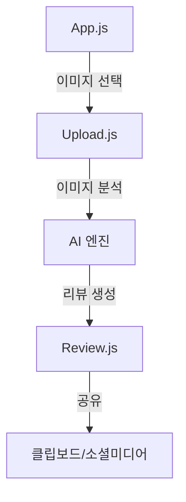

# 📱 Review AI

<div align="center">
  
  
  
  
</div>

## 📋 프로젝트 소개
Review AI는 사용자가 업로드한 이미지를 분석하여 AI가 자동으로 리뷰를 생성해주는 모바일 애플리케이션입니다. Hugging Face의 AI 모델을 활용하여 이미지 분석과 리뷰 생성을 수행하며, 생성된 리뷰는 클립보드에 복사하여 쉽게 공유할 수 있습니다.

## 🎯 주요 기능

### 📸 이미지 업로드
- **갤러리 선택**
  - 기기 갤러리에서 이미지 선택
  - 이미지 크기 및 형식 검증
  - 이미지 최적화 처리

- **카메라 촬영**
  - 기본 카메라 기능 제공
  - 이미지 편집 기능
  - 고품질 이미지 저장

### 🤖 AI 리뷰 생성
- **이미지 분석**
  - BLIP 모델을 활용한 이미지 캡셔닝
  - 이미지 내용 자동 인식
  - 이미지 분류 및 태깅

- **리뷰 생성**
  - Mixtral-8x7B 모델을 활용한 자연어 생성
  - 자연어 처리 및 문장 생성
  - 문맥 기반 리뷰 최적화

### 📋 리뷰 관리
- **리뷰 확인 및 공유**
  - 생성된 리뷰 보기
  - 클립보드 복사

## 🤖 AI 모델

### 📸 이미지 분석 모델
**BLIP (Bootstrapping Language-Image Pre-training)**
- 모델: `Salesforce/blip-image-captioning-large`
- 용도: 이미지 내용 자동 인식 및 설명 생성
- 특징:
  - 이미지의 주요 객체와 상황을 자연어로 설명
  - 음식 이미지에 특화된 캡셔닝 성능
  - 다국어 지원 (한국어 포함)
- 입력: 이미지 파일
- 출력: 이미지 설명 텍스트

### 📝 리뷰 생성 모델
**Mixtral-8x7B-Instruct**
- 모델: `mistralai/Mixtral-8x7B-Instruct-v0.1`
- 용도: 자연스러운 리뷰 텍스트 생성
- 특징:
  - 8개의 전문 모델을 혼합한 MoE(Mixture of Experts) 구조
  - 32K 컨텍스트 길이 지원
  - 한국어 자연어 생성에 최적화
- 입력:
  - 메뉴 정보
  - 이미지 설명
  - 평점 정보 (배달, 맛, 양, 가격)
- 출력: 자연스러운 리뷰 텍스트

### ⚙️ 모델 파라미터
```javascript
// 리뷰 생성 파라미터
{
  max_new_tokens: 512,      // 최대 생성 토큰 수
  temperature: 0.8,         // 생성 다양성 조절 (0.0 ~ 1.0)
  top_p: 0.9,              // 누적 확률 임계값
  repetition_penalty: 1.15  // 반복 방지 계수
}
```

### 🔄 모델 처리 흐름
1. 이미지 업로드
2. BLIP 모델로 이미지 분석
3. 분석 결과와 사용자 입력 결합
4. Mixtral 모델로 리뷰 생성
5. 이모지 추가 및 후처리

## 📱 시스템 요구사항
- Node.js 14.0.0 이상
- Expo CLI
- iOS 13.0 이상 또는 Android 5.0 이상

## 🔧 설치 방법
1. 프로젝트를 클론합니다:
```bash
git clone https://github.com/JongHyun070105/Review_AI.git
```

2. 의존성을 설치합니다:
```bash
npm install
```

3. 환경 변수 설정:
```bash
cp .env.example .env
# .env 파일에 필요한 API 키들을 설정합니다.
```

4. 앱을 실행합니다:
```bash
npm start
```

## 🔑 API 키 설정
프로젝트를 실행하기 위해서는 다음 API 키가 필요합니다:

### 🤖 AI 서비스 API 키
**Hugging Face API 키**
- [Hugging Face](https://huggingface.co/)에서 계정을 생성하고 API 키를 발급받습니다.
- 이미지 분석 및 리뷰 생성을 위한 모델에 접근하기 위해 필요합니다.
- 무료 티어: 월 30,000회 API 호출 가능

### ⚙️ 환경 변수 설정
`.env` 파일에 다음과 같이 API 키를 설정합니다:
```env
# AI 서비스
HUGGING_FACE_API_KEY=your_hugging_face_api_key

# 서버 설정
PORT=3000
```

## 🏗️ 시스템 아키텍처

### 🔄 아키텍처 패턴
- React Native 기반 크로스 플랫폼 개발
- Expo 프레임워크 활용
- Express.js 백엔드 서버
- Hugging Face AI 엔진

### 🧩 주요 컴포넌트
1. **프론트엔드**
   - App.js: 메인 애플리케이션
   - Upload.js: 이미지 업로드 화면
   - Review.js: 리뷰 관리 화면
   - Font.js: 폰트 설정

2. **백엔드**
   - server.js: Express.js 서버
   - API 엔드포인트
   - 이미지 처리 로직

3. **AI 엔진**
   - BLIP 이미지 캡셔닝 모델
   - Mixtral-8x7B 리뷰 생성 모델
   - Hugging Face API

## 🔄 앱 흐름도



## 🛠️ 기술 스택
<div align="center">
  <table>
    <tr>
      <td align="center">
        
        <br>React Native
      </td>
      <td align="center">
        
        <br>Hugging Face
      </td>
      <td align="center">
        
        <br>Express.js
      </td>
    </tr>
  </table>
</div>

## 📈 성능 최적화

### 🖼️ 이미지 최적화
- Sharp를 사용한 이미지 처리
- Expo Image Manipulator 활용
- 메모리 관리 최적화

### 🌐 네트워크 최적화
- API 응답 캐싱
- 이미지 전송 최적화
- 오프라인 지원

## 🔐 보안

### 🔒 데이터 보안
- API 키 보안
- 이미지 데이터 암호화
- 네트워크 통신 보안

### 🔑 권한 관리
- 카메라 접근 권한
- 갤러리 접근 권한
- 네트워크 접근 권한

## 📄 라이센스
이 프로젝트는 MIT 라이센스를 따릅니다.
